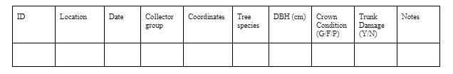

## Introduction
Trees and other vegetation provide a wide range of benefits to urban settings. Some of these benefits include cooling of the environment, absorbing stormwater, enhancing aesthetics and notably, absorbing carbon dioxide and pollutants (Duinker et al., 2015). One area in Halifax that has an abundance of trees for these reasons is the Halifax Waterfront. The waterfront area that was analysed has over 300 trees with a wide range of species and ages. The trees found at the Halifax Waterfront are managed by DevelopNS. 

While it is possible that a few of these trees grew naturally, and were developed around, the majority of these trees have been planted and maintained over the course of their life. While it’s known that trees are beneficial for reducing pollution in urban settings (Guidolotti et al., 2016) , our question is whether pollution has a negative impact on tree health and growth. More specifically, we are going to analyse whether trees in closer proximity to the road have a negative impact on their health. The World Health Organization listed road pollutants as one major source of air pollutants globally, affecting both humans and local ecological systems (Aggarwal & Jain, 2015). While pollutants are a concern for trees near roads there is also the danger of physical damage to trees due to high traffic.  We will look at these issues by comparing trees near roads to those that are not. We hypothesize that the trees near roads will be in less healthy conditions with respect to crown coverage, trunk damage, and leaf health.

## Methods
Data was collected by all class participants with the aid of our professor, Dr. Erin Cameron and teacher assistants, Tyler and Madi. All trees that belonged to the HRM at the waterfront had their data collected. Our boundaries for data collection were north of the Halifax Seaport Market, south of the Marriott Hotel, and Barrington Street to the water. Trees on privately managed patios were not included in our study. The parameters can be seen in Figure 1.




Each tree’s trunk was measured using a DBH tape at breast height (4.3 ft) above ground level). This measurement was recorded as the diameter of the trunk. If the trunk had multiple branches greater than 2 cm at breast height, these measurements were recorded in the notes section. Trunk damage was noted if there was any - simply by walking around the tree and examining the trunk. The crown condition was also examined and given a value of good, fair, or poor. The crown condition was measured on a basis of the amount of leaves on the branches. If there were any disease, galls, die-back, or insect damage on the leaves, or if  branches were missing, it was written down in the notes. The species of trees were identified in the field by either prior knowledge of certain tree characteristics, or by referencing the book Trees in Canada (Farrar, 2016). Only their four-letter species ID was recorded. This species ID is denoted by the first two letters of the genus, followed by the first two letters of the species. An example of this is ACRU, which represents the Acer rubrum, more commonly known as the red maple tree. If the tree was tethered, that was also recorded in the notes. 

When noting the location of trees, an app on a tablet called “Field Maps” (ESRI, 2021) was used to reference the trees we were looking at. A map layer created previously was available for us to view. Due to this we were able to cross reference what trees we were looking at spatially. All the data was recorded on paper. When field work was complete, the class had gathered data for 352 trees. The data was then put into a collaborative Google Docs sheet to clean up any mistakes that were noted and to ensure the data from both groups was consistent.

## Data Analysis 
To begin our analysis, we converted the “x” column, representing longitude coordinates, from the dataframe “tree_data”, from characters to numerical values. The “y” column, representing the latitude coordinates, was already presented in numerical values. These numerical values were then assigned the WGS 84 coordinate reference system. 
EXPLAIN MAP INSTRUCTIONS??
A data frame created by Greg Baker, named “gregtrees” (CITE), with the desired coordinate reference system for the analysis, being measured in meters, was used. We inserted the data frame into the program and transformed the tree data to mimic the reference used within Greg’s data. 
The data was filtered to isolate the trees at the Halifax Waterfront. 


```{r, echo = FALSE, include = FALSE}

```


