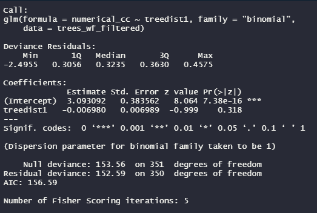
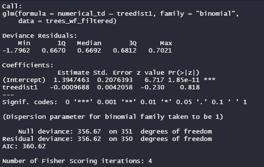

## Introduction
Trees and other vegetation provide a wide range of benefits to urban settings. Some of these benefits include cooling of the environment, absorbing stormwater, enhancing aesthetics and notably, absorbing carbon dioxide and pollutants (Duinker et al., 2015). One area in Halifax that has an abundance of trees for these reasons is the Halifax Waterfront. The waterfront area that was analysed has over 300 trees with a wide range of species and ages. The trees found at the Halifax Waterfront are managed by DevelopNS. 

While it is possible that a few of these trees grew naturally, and were developed around, the majority of these trees have been planted and maintained over the course of their life. While it’s known that trees are beneficial for reducing pollution in urban settings (Guidolotti et al., 2016) , our question is whether pollution has a negative impact on tree health and growth. More specifically, we are going to analyse whether trees in closer proximity to the road have a negative impact on their health. The World Health Organization listed road pollutants as one major source of air pollutants globally, affecting both humans and local ecological systems (Aggarwal & Jain, 2015). While pollutants are a concern for trees near roads there is also the danger of physical damage to trees due to high traffic.  We will look at these issues by comparing trees near roads to those that are not. We hypothesize that the trees near roads will be in less healthy conditions with respect to crown coverage, trunk damage, and leaf health.

## Methods
Field Data Collection

Data was collected by all class participants with the aid of our professor, Dr. Erin Cameron and teacher assistants, Tyler and Madi. All trees that belonged to the HRM at the waterfront had their data collected. Our boundaries for data collection were north of the Halifax Seaport Market, south of the Marriott Hotel, and Barrington Street to the water. Trees on privately managed patios were not included in our study. The parameters can be seen in Figure 1.


Each tree’s trunk was measured using a DBH tape at breast height (4.3 ft) above ground level. This measurement was recorded as the diameter of the trunk. If the trunk had multiple branches greater than 2 cm at breast height, these measurements were recorded in the notes section. Trunk damage was noted if there was any - simply by walking around the tree and examining the trunk. The crown condition was also examined and given a value of good, fair, or poor. The crown condition was measured on a basis of the amount of leaves on the branches. If there were any disease, galls, die-back, or insect damage on the leaves, or if  branches were missing, it was written down in the notes. The species of trees were identified in the field by either prior knowledge of certain tree characteristics, or by referencing the book Trees in Canada (Farrar, 2016). Only their four-letter species ID was recorded. This species ID is denoted by the first two letters of the genus, followed by the first two letters of the species. An example of this is ACRU, which represents the Acer rubrum, more commonly known as the red maple tree. If the tree was tethered, that was also recorded in the notes. 

When noting the location of trees, an app on a tablet called “Field Maps” (ESRI, 2021) was used to reference the trees we were looking at. A map layer created previously was available for us to view. Due to this we were able to cross reference what trees we were looking at spatially. All the data was recorded on paper. When field work was complete, the class had gathered data for 352 trees. The data was then put into a collaborative Google Docs sheet to clean up any mistakes that were noted and to ensure the data from both groups was consistent.

Data Analysis 

  A map was created to allow visualization of the data in relation to the physical environment.  The package entitled “sf” was loaded. A shape file named “Street_Name_Routes.shp”, provided by Erin Cameron from the Department of Environmental Science at Saint Mary's University, was also loaded and showed the street routes near the waterfront. From there, loading the data collected by the class from the csv file entitled “CorrectedData_ENVS4826.csv” was done. Simultaneously, assigning the columns containing the coordinate data the same as the street routes shape file was completed. Next, we filtered the data to include only those collected at the waterfront using the package “dplyr”. A boundary box was created, with coordinates slightly exceeding the minimum and maximum coordinates from the tree data, and was then cropped to the background of the box. We then proceeded by loading the package called “ggplot2” and creating two maps of the background and tree locations, one coloured by crown condition and the other by trunk damage. It was necessary to correct an error in the data as one “y” instead of “Y”, before creating the map coloured by trunk damage. 
To set up the data for graphs and analysis, we loaded a shape file entitled “gregtrees.shp”, provided  by Greg Baker from the Department of Geology at Saint Mary's University,  to use as a reference to change the coordinate system of the tree data and background to NAD83 which operates in units of meters. The distance for every tree from the nearest road based on the background street data and added the distances into the data frame in a new column was then noted. From there, we created a new column where we reassigned the crown condition value “G”  and “F” the number 1, and “P” the number 0. Similarly we created a column to assign trunk condition value “N” the number 1 and “Y” the value 0. We then reassigned the two new columns to a numeric structure. A graph was then created using the tree distances from the nearest road as the x-axis and the reassigned values for crown condition as the y-axis and coloured the points by original crown condition values. We then repeated this process using trunk damage for another graph. 
Two proportion generalised linear models were then ran. Both models contained tree distance from the nearest road as the x value. However, one used the numerical values of crown condition as the x value, while the other used the  numerical values of trunk damage as the x value. Finally we conducted a Hosmer Lemeshow test for each of the models. 

## Results
	The maps that were created showed tree conditions (crown condition and trunk damage) and where they were located along the Halifax waterfront. By looking at the map showing crown condition, the “G” meaning good crown condition, seems the most common (Figure 2). As for the map showing trunk damage, “N” meaning no damage, seems the most common (Figure 3). No other patterns are noted within these maps. 


```{r, echo = FALSE, include = FALSE}
library(sf)
library(ggplot2)
library(dplyr)
library(ggspatial)
library(generalhoslem)

background <- st_read("Street_Name_Routes.shp")

tree_database_coord <- st_read("CorrectedData_ENVS4826.csv",
                               options = c("X_POSSIBLE_NAMEs=x", 
                                           "Y_POSSIBLE_NAMES=Y"),
                               crs = 4326) 

trees_wf <- filter(tree_database_coord, location == "waterfront")

trees_wf_bbox <- st_bbox(c(xmin = -63.5750000, ymin = 44.642000, xmax = -63.566000, ymax = 44.6510000),
                         crs = st_crs(background))
background_cropped <- st_crop(background, trees_wf_bbox)

trees_wf$trunk_damage[262] = "Y"

```
```{r,echo=FALSE, include = TRUE}
ggplot() +
  geom_sf(data = background_cropped) +
  geom_sf(data = trees_wf, mapping = aes(colour = crown_condition)) +
  labs(x = "Longitude", y = "Latitude", colour = "Crown Condition") + 
  ggtitle("Waterfront Trees Crown Condition") + 
  scale_colour_manual(values = c("#330066", "#009999", "#FFFF00"), 
                      labels = c("Fair", "Good", "Poor")) +
  annotation_north_arrow(location = "bl", which_north = "true", 
                         pad_x = unit(1, "in"), pad_y = unit(1, "in"),
                         style = north_arrow_fancy_orienteering) +
  theme_bw() +
  theme(panel.grid = element_blank(), axis.text.x = element_text(angle = 90, vjust = 0.5, hjust=1))
```
Figure 2: Spatial map of the Halifax waterfront tree data based on the crown condition of trees

```{r, echo=FALSE, include=TRUE}
ggplot() +
  geom_sf(data = background_cropped) +
  geom_sf(data = trees_wf, mapping = aes(colour = trunk_damage)) +
  labs(x = "Longitude", y = "Latitude", colour = "Trunk Damage") + 
  ggtitle("Waterfront Trees Trunk Damage") + 
  scale_colour_manual(values = c("#330066", "#FFFF00"), 
                      labels = c("No", "Yes")) +
  annotation_north_arrow(location = "bl", which_north = "true", 
                         pad_x = unit(1, "in"), pad_y = unit(1, "in"),
                         style = north_arrow_fancy_orienteering) +
  theme_bw() +
  theme(panel.grid = element_blank(), axis.text.x = element_text(angle = 90, vjust = 0.5, hjust=1))
```
Figure 3: Spatial map of the Halifax waterfront tree data based on the trunk damage on trees. 

The results show that for crown condition, most trees are classified as “1” pertaining to characteristics of “Good” or “Fair” (Figure 4). The majority of these trees are also found within a 100m distance from the nearest road. Trees classified as “Poor” were not as plentiful. No trees with poor crown conditions were found greater than 100m away from the nearest road (Figure 4). 

```{r, echo=FALSE, include=FALSE}
greg<-st_read("gregtrees.shp")
tree_projected <- st_transform(trees_wf,st_crs(greg))
streets_transform <- st_transform(background_cropped, st_crs(greg))

treedist1 <- sapply(1:nrow(tree_projected), function(x) min(st_distance(streets_transform, tree_projected[x, ])))
trees_wf_filtered <- cbind(tree_projected, treedist1)

trees_wf_filtered$numerical_cc <- recode(trees_wf_filtered$crown_condition, G = 1, F = 1, P = 0)
trees_wf_filtered$numerical_td <- recode(trees_wf_filtered$trunk_damage, N = 1, Y = 0)

trees_wf_filtered$numerical_cc <- as.numeric(trees_wf_filtered$numerical_cc)

trees_wf_filtered$numerical_td <-as.numeric(trees_wf_filtered$numerical_td)

```

```{r, echo=FALSE, include=TRUE}
ggplot(data = trees_wf_filtered, 
       aes(x = treedist1, y = numerical_cc, colour = crown_condition)) +
  geom_point() +
  geom_smooth(method = "glm",se = FALSE, color = "black",
              method.args = list(family = "binomial")) +
  labs(x = "Distance from road (m)", y = "Crown condition", colour = "Crown Condition") +
  ggtitle ("Crown Condition") +
  theme_bw() +
  theme(panel.grid = element_blank()) + 
  scale_colour_manual(values = c("#330066", "#009999", "#FFFF00"), 
                      labels = c("Fair", "Good", "Poor"))
```
Figure 4: A plot of the crown conditions of trees at the Halifax waterfront in comparison to the nearest road distance

The results show that trees with no trunk damage, classified as “1”, are found in greater amounts than trees with trunk damage, classified as “0”(Figure 5). Few trees are located outside of a 100m distance that have trunk damage. 

```{r, echo=FALSE, include=TRUE}
ggplot(data = trees_wf_filtered, 
       aes(x = treedist1, y = numerical_td, colour = trunk_damage)) +
  geom_point() +
  geom_smooth(method = "glm", se = FALSE, color = "black",
              method.args = list(family = "binomial")) +
  labs(x = "Distance from road (m)", y = "Trunk damage", colour = "Trunk Damage") +
  ggtitle ("Trunk Damage") +
  theme_bw() +
  theme(panel.grid = element_blank()) +
  scale_colour_manual(values = c("#330066", "#FFFF00"), 
                      labels = c("1 = No", "0 = Yes"))
```
Figure 5: A plot recording trunk damage of trees found at the Halifax waterfront in comparison to the nearest road distance.

The Pr(>|z|) value, which represents the p-value for our parameter “treedist1” when using crown condition data, is 0.318 (Figure 6). When using “treedist1” with trunk damage data, the p-value is shown as 0.818 (Figure 7). 



The Hosmer and Lemeshow test shows that for both crown condition and trunk damage of trees that the the values are insignificant. The values found by running these tests were 0.8545 and 0.01371, respectively (Figure 8; Figure 9). 


## Discussion
The data collected does not support our hypothesis that the health of a tree is related to it's distance from the nearest road. Both crown condition and trunk damage showed no correlation to the distance from the nearest road. These results could be affected by the fact that a large portion of the trees at the waterfront are in close proximity to the road. This means that there are not enough trees at a far distance from the road to make a meaningful comparison. If this analysis was repeated it would be be beneficial to regroup the data for crown condition to analyze "Good" separately from "Fair" and "Poor", rather than having "Good" and "Fair" together. This is because many of the trees were categorized as "Fair". Fair covers a wider range of crown conditions that could have potentially been a result of distance to the nearest road. Additionally, this analysis can be conducted by splitting the trees up into discrete groups based on their proximity to the nearest road, rather than analyze them on a continuous distance scale like we did. We also also could have analyzed information collected in the comment column such as diseased leaves or the presence of gulls in relation to road proximity. Finally, repeating this analysis with data collected from Saint Mary's University may have yielded different results due to the differences in the tree's spatial arrangement in relation to nearby roads. 


